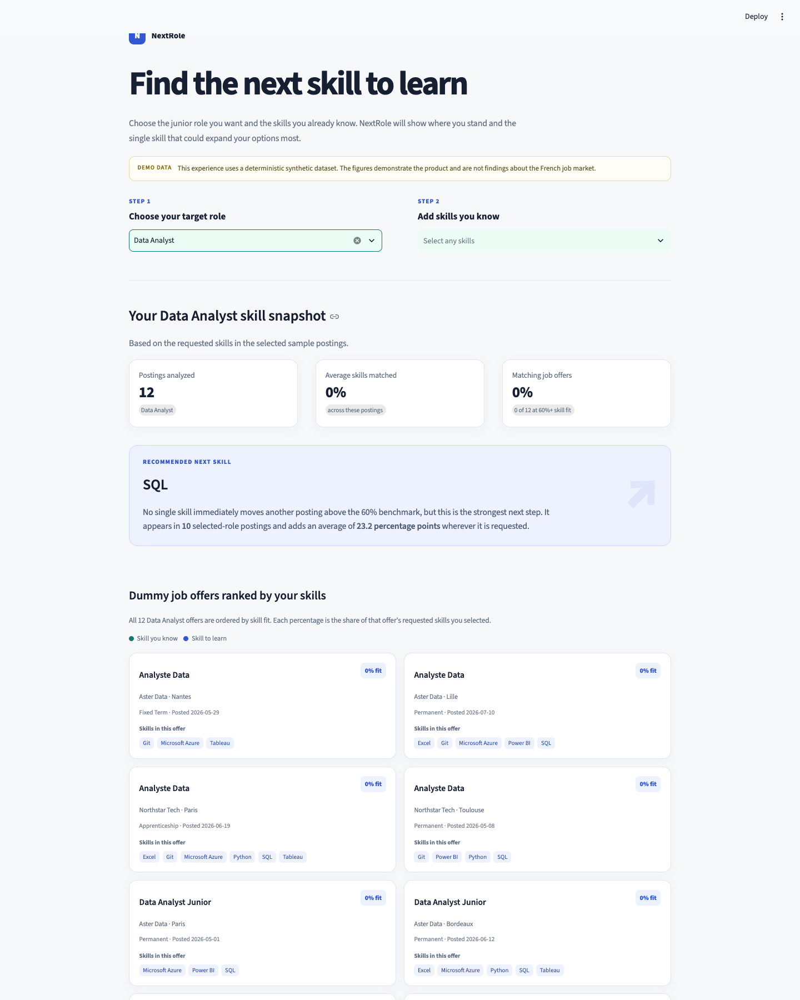

# NextRole

NextRole is a small data platform for exploring junior tech jobs in France. It collects
France Travail job postings, cleans and stores them in PostgreSQL, extracts requested
technical skills, and presents the results in a Streamlit dashboard.

The dashboard helps users compare junior roles, see in-demand skills, check how their
current skills match individual offers, and choose a useful skill to learn next.



> The included demo uses synthetic data, so it works without API credentials or a
> database and should not be treated as a view of the real job market.

## Run the demo

### With Docker

```bash
docker compose up --build demo
```

Then open [http://localhost:8501](http://localhost:8501).

### Locally

Python 3.12–3.14 is required.

```bash
make setup
make demo
```

Then open the URL printed by Streamlit, usually
[http://localhost:8501](http://localhost:8501).

## What is included

- A France Travail API collector and raw snapshot storage
- Data validation, normalization, skill extraction, and deduplication
- A PostgreSQL warehouse with analytical views
- A synthetic sample dataset and interactive Streamlit dashboard
- Tests, linting, typing checks, and Docker support

To run all local quality checks:

```bash
make check
```

More detail is available in the [methodology](docs/methodology.md) and
[data dictionary](docs/data-dictionary.md).
